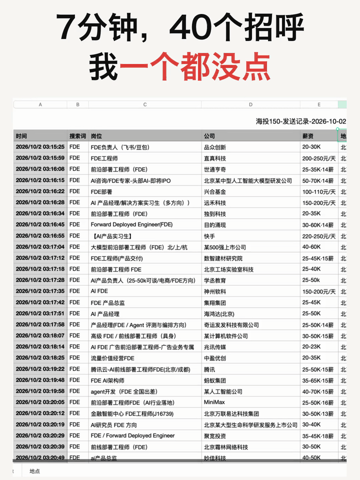
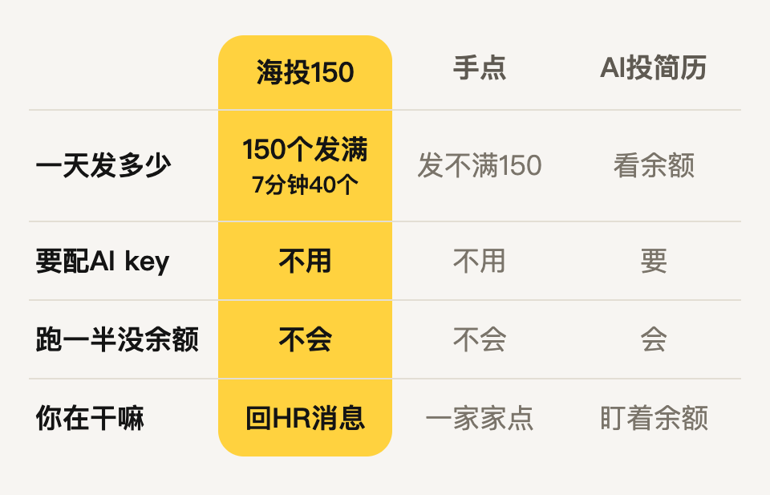
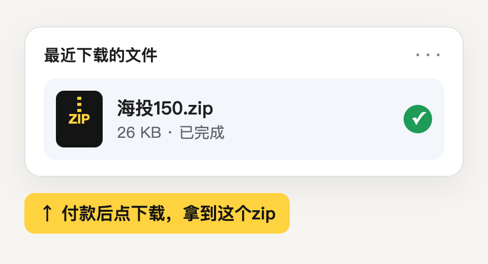
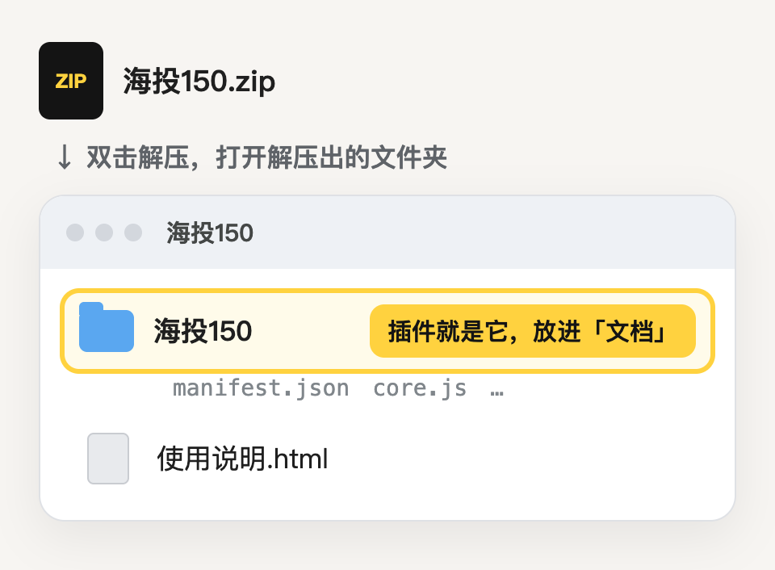
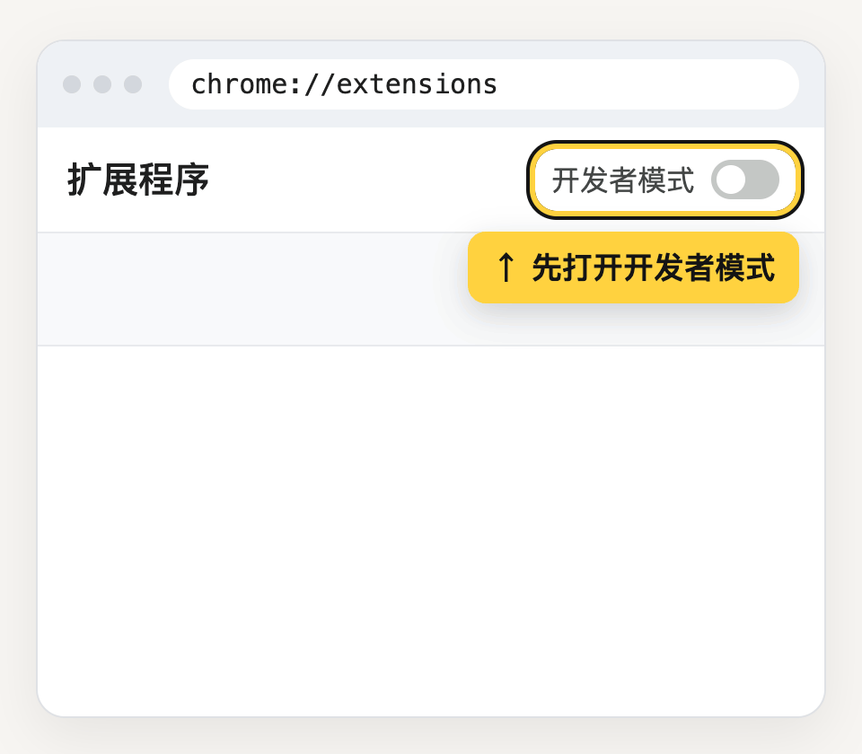

# 我把150个招呼发满 1小时后来了面试邀请

> 9月29号那天150个发满，一小时后手机上是：1个面试邀请，3个HR要简历，1个说先帮我做简历推荐，2个问是不是全职，五六个说不合适。

## 跟手点、AI投简历比，差在哪

- **填两样就开始**：搜索词和月薪下限，点「开始」
- **到数自己停**：BOSS弹验证也停，过完点「继续」接着发
- **只投你要的**：岗位名要有什么、不要什么，要不要实习岗，都能设
- **快慢你定**：默认每家隔20到40秒，调到5到10秒就是7分钟40个
- **发过哪几家**：点「导出记录」存成表，Excel直接打开

## 三步装好

   

### 1. 付款后下载zip

收据邮件里也有下载链接。

### 2. 解压，把「海投150」文件夹放进「文档」

### 3. 在Chrome里加载这个文件夹

地址栏输入`chrome://extensions`，打开「开发者模式」，点「加载已解压的扩展程序」，选「海投150」文件夹。Edge输入`edge://extensions`，步骤一样。

装好后点浏览器右上角的拼图图标，再点海投150，它会打开BOSS职位页，登录后右下角就是面板。

## 常见问题

**会不会封号？** BOSS协议禁止这类工具，风险你自己掂量。它在你自己的网页上按手点的快慢点，碰到验证就停。

**手机能用吗？** 要电脑。手机上可以先买，回电脑打开收据邮件下载。

**装不上、发不出去？** [开个issue](https://github.com/droid-1-wq/haitou150/issues/new)，贴一张面板截图。

 

今天装上，今天的150个招呼就能发出去。

