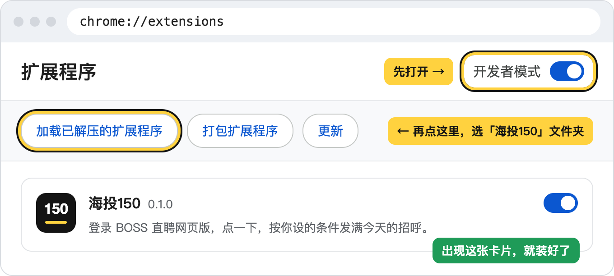

# BOSS一天150个招呼，交给电脑发满

## 你只管填两样，点开始

搜索词填想投的方向，月薪下限填能接受的最低数，点「开始」。它就在你登录好的BOSS网页上一家家发，你拿手机回HR的消息就行。

- 发到你设的数就停，BOSS弹安全验证也停，你手动过完点「继续」接着发
- 岗位名里要有什么、不要什么（比如不要销售、客服），要不要实习岗，都能设
- 每家隔多久你来定，默认20到40秒，调到5到10秒就是上面7分钟40个的速度
- 发过哪几家，点「导出记录」存成一张表，Excel直接打开

> 9月29号我把150个招呼发满，一小时后回来1个面试邀请、3个HR要简历。

## 三步装好

1. 付款后下载zip，收据邮件里也有下载链接
2. 解压，得到「海投150」文件夹，放到不会被删的地方，比如「文档」
3. Chrome地址栏输入`chrome://extensions`，打开右上角「开发者模式」，点「加载已解压的扩展程序」，选这个文件夹

装好后点浏览器右上角的拼图图标，再点海投150，它会打开BOSS职位页，登录后右下角就是面板。Edge也能装，地址栏换成`edge://extensions`。

## 常见问题

**会不会封号？** 
它就在你自己打开的BOSS网页上替你点按钮，和你手点是同一个页面、差不多的快慢。BOSS直聘的用户协议禁止用这类工具，风险你自己掂量。

**要AI吗，要充值吗？** 
都不用，也不用配key。买断之后发多少都不再花钱。

**手机能用吗？** 
要电脑，Windows、Mac上的Chrome或Edge都行。手机上可以先买，回电脑打开收据邮件下载。

**一天能发多少？** 
BOSS一天给150个招呼的额度，海投150帮你发满。想少发，把面板上的「今天最多」改小。

**装不上、发不出去怎么办？** 
[开个issue](https://github.com/droid-1-wq/haitou150/issues/new)，贴一张面板截图。

 

今天装上，今天的150个招呼就能发出去。

